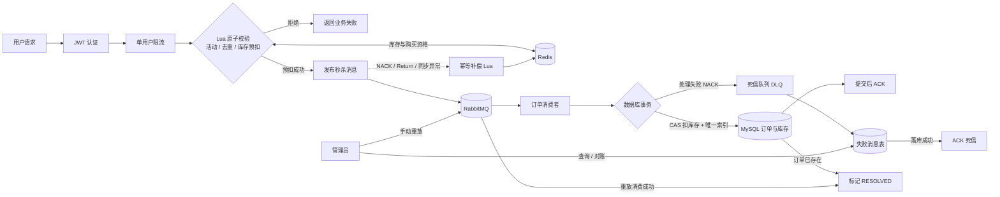

# 秒杀订单可靠性系统 Seckill Demo

[](https://github.com/VirtueLazy/seckill-demo/actions/workflows/ci.yml)

基于 Spring Boot 4.1.1、Redis、RabbitMQ 和 MySQL 实现的秒杀可靠性练习项目，重点验证并发场景中的超卖、重复下单、异步落库、发布失败补偿和死信重放。项目保留已知边界，不宣称达到生产级高可用。

## 技术栈

- Spring Boot 4.1.1、JDK 17
- Spring Security、JWT
- Redis、Lua
- RabbitMQ
- MyBatis-Plus、MySQL 8
- JUnit、Mockito

## 秒杀链路



## 核心设计

### 防止超卖

Redis Lua 把库存检查和扣减放在一次原子操作中。消费者落库时使用：

```sql
UPDATE seckill_activity
SET seckill_stock = seckill_stock - 1
WHERE id = ? AND seckill_stock > 0;
```

Redis 负责挡住高并发请求，数据库条件更新作为最后一道库存保护。

### 防止重复下单

- Redis Set 在入口拦截同一用户的重复请求。
- 数据库唯一索引 `(seckill_activity_id, user_id)` 防止重复消息生成两份订单。

### MQ 异步削峰

接口完成 Redis 裁决后发送 RabbitMQ 消息，消费者异步执行数据库事务。消费者在事务提交后手动 ACK；异常消息进入死信队列，避免无限重试。

### 发布失败补偿

- 每条消息携带活动 ID、用户 ID 和唯一关联 ID。
- Broker 明确 NACK，或消息到达交换机却无法路由时，发布回调触发补偿。
- `compensate_seckill.lua` 先从已购买集合移除用户，只有移除成功才恢复库存；因此 Confirm 和 Return 重复触发也不会重复加库存。
- `convertAndSend` 同步抛出异常时同样尝试撤销预约，并向调用方返回失败。

这套补偿处理的是“明确失败”。如果 Broker 实际收到了消息，但应用在收到确认前发生网络中断，结果仍具有歧义，生产系统需要预约状态、持久化事件或定时对账进一步兜底。

### 死信持久化、重放与对账

- DLQ 消费者先将失败消息写入 `seckill_failed_message`，写入成功后才 ACK；数据库不可用时 NACK 并保留消息。
- `(activity_id, user_id)` 唯一索引使重复死信幂等落库，已解决记录不会被迟到的重复死信重新打开。
- 管理员可查询待处理记录、手动重放，或扫描订单表完成状态对账。
- 数据库条件更新原子抢占重放权，同一记录 30 秒内只能重放一次，避免连续点击造成消息风暴。
- 重放消息携带失败记录 ID；订单事务成功或发现订单已存在时，将记录标记为 `RESOLVED`。
- 重放发布失败时记录仍保持 `PENDING`，不会恢复 Redis 预约，避免旧消息与用户新请求同时下单。

### 权限与配置

- 普通用户可以参加秒杀和查询商品。
- 库存预热及商品写操作要求 `ADMIN` 角色。
- 数据库、Redis、RabbitMQ 密码及 JWT 密钥均支持环境变量覆盖。

## 本地运行

环境要求：JDK 17、Maven、Docker Compose。

```bash
docker compose up -d
mvn test
mvn spring-boot:run
```

`compose.yaml` 会启动 MySQL、Redis 和 RabbitMQ，`db/schema.sql` 会初始化完整表结构与示例活动。RabbitMQ 管理页面为 `http://localhost:15672`。

如果本地已有旧版 MySQL 数据卷，初始化脚本不会再次执行。请手动创建 `seckill_failed_message` 表，或在确认不需要保留本地数据后执行 `docker compose down -v`，再重新启动环境。

生产或共享环境不要使用仓库中的开发默认密码。环境变量示例见 `.env.example`。

## 主要接口

- `POST /api/user/register`：注册
- `POST /api/user/login`：登录并获取 JWT
- `POST /api/seckill/preload/{activityId}`：管理员预热库存
- `POST /api/seckill/{activityId}`：发起秒杀
- `GET /api/seckill/failures`：管理员查询待处理死信
- `POST /api/seckill/failures/{failedMessageId}/replay`：管理员重放单条死信
- `POST /api/seckill/failures/reconcile`：管理员将已有订单对应的死信标记为已解决
- `GET /api/product/list`：商品列表

除注册和登录外，请求需要携带 `Authorization: Bearer <token>`。新注册用户默认为 `USER`；将数据库中的角色改为 `ADMIN` 后，需要重新登录获取 Token。

## 测试

```bash
mvn test
```

- `SeckillReservationCompensatorTest`：验证重复补偿只恢复一次预约。
- `SeckillPublishFailureHandlerTest`：验证 Broker NACK、正常 ACK 和无法路由三种发布结果。
- `SeckillMessagePublisherTest`：验证重放标记与业务关联信息正确写入消息。
- `SeckillConsumerTest`：验证死信持久化成功才 ACK，落库失败会重新入队。
- `SeckillFailureServiceTest`：验证死信落库、重放限频、已有订单对账和批量对账。
- `FailedSeckillMessageMapperTest`：连接 MySQL 验证幂等写入、原子重放抢占和终态保护。
- `SeckillServiceImplTest`：验证同步发布异常会撤销预约，并且不会向调用方返回成功。
- `SeckillConcurrentTest`：显式开启后，以不同用户同时请求并输出分类结果和 P50/P95/P99，验证 Redis 受理数不超过库存。

仓库还提供了 [k6 压测场景](performance/README.md)，包含隔离环境数据重置、不同并发档位、结果导出和订单/库存/死信核验 SQL。已执行的 CI 并发冒烟数据及限制记录在 [压测报告](performance/REPORT.md) 中。

GitHub Actions 会启动 MySQL、Redis、RabbitMQ，执行 Maven 测试，并运行“20 个独立用户抢 10 件库存”的并发冒烟；流水线会核验最终订单数、重复订单、双端库存和待处理死信。仓库中的通过状态是可复现的正确性验证，不代表线上容量。

## 已知边界

这是一个便于学习和面试讲解的基础版本，不宣称已经达到生产级可靠性：

- 网络中断可能产生“Broker 已接收但应用未收到确认”的歧义结果；订单侧已有人工对账入口，但 Redis 预约仍缺少完整状态机。
- 如果发布回调执行补偿时 Redis 不可用，目前只记录错误，没有持久化补偿任务。
- 死信支持持久化、人工对账与手动重放，但尚未实现告警和安全的自动重试调度。
- 现有并发程序属于功能验证，不是正式的高并发性能报告。

这些边界可以作为后续学习方向，但不建议在尚未掌握时直接堆入项目。
